<div align="center">


# Cussi Parking

**Never lose your car again.** Smart, automatic parking tracking with full privacy and self-hosted server support.

[](https://kotlinlang.org/)
[](https://developer.android.com/)
[](https://m3.material.io/)
[](LICENSE)
[](https://github.com/marcomorosi06/Cussi-Parking-Server)

</div>

---

## Table of Contents

- [What is Cussi Parking?](#what-is-cussi-parking)
- [Features at a Glance](#features-at-a-glance)
- [Requirements](#requirements)
- [Getting Started](#getting-started)
  - [Onboarding](#onboarding)
  - [Setting Up a Server Profile](#setting-up-a-server-profile)
- [Saving Your Vehicle's Location](#saving-your-vehicles-location)
  - [Manual Save — Tap on Map](#manual-save--tap-on-map)
  - [Manual Save — GPS Button](#manual-save--gps-button)
- [Automatic Triggers](#automatic-triggers)
  - [How Triggers Work](#how-triggers-work)
  - [Bluetooth Trigger](#bluetooth-trigger)
  - [NFC Trigger](#nfc-trigger)
  - [GPS Modes: Precise vs Last Known](#gps-modes-precise-vs-last-known)
- [Finding Your Vehicle](#finding-your-vehicle)
- [Sharing a Vehicle](#sharing-a-vehicle)
- [Multi-Server Support](#multi-server-support)
- [Offline Mode](#offline-mode)
- [Permissions Explained](#permissions-explained)
- [Architecture Overview](#architecture-overview)
- [Self-Hosted Server](#self-hosted-server)
- [Privacy](#privacy)
- [Contributing](#contributing)
- [Building from Source](#building-from-source)
- [License](#license)

---

## What is Cussi Parking?

Cussi Parking is an open-source Android app that remembers where you parked... automatically! When you leave your car, the app detects the event (Bluetooth disconnection, NFC tag tap) and saves the GPS coordinates of your vehicle in the background, without you lifting a finger.

You can run it fully **offline** (data stays on-device only), or connect it to your own **self-hosted server** to sync parking spots across multiple devices and share vehicles with family or colleagues.

This project follows the philosophy "privacy by design". Your location data never goes to third-party servers. You own the backend.

---

## Features at a Glance

| Feature | Description |
|---|---|
| **Auto-save on Bluetooth** | Saves position when car's hands-free kit disconnects |
| **Auto-save on NFC** | Tap an NFC sticker on the windshield to save position |
| **Manual save** | Tap on map or press GPS button at any moment |
| **OSM Map** | Open-source map, no Google Maps required |
| **Family sharing** | Share vehicle location with members via invite code |
| **Multi-server** | Connect to multiple self-hosted servers simultaneously |
| **Offline mode** | Full functionality without any server |
| **Rich notifications** | Distinct notification per trigger source |
| **Material 3 Expressive** | Adaptive theming, fluid animations |

---

## Requirements

- Android **8.0 (API 26)** or higher
- For automatic triggers: **Background Location** permission
- For Bluetooth trigger: **Nearby Devices** permission (Android 12+)
- For NFC trigger: device with **NFC hardware** (not mandatory — feature degrades gracefully)
- For sync: a self-hosted **[Cussi Parking Server](https://github.com/marcomorosi06/Cussi-Parking-Server)** (PHP + SQLite, runs on a Raspberry Pi)

---

## Getting Started

### Onboarding

The first time you open Cussi Parking, a welcome screen guides you through the basic setup.

You can choose to:
- Use the app **offline** (no server, no account needed)
- Connect to a **self-hosted server** and create an account

You can always change this choice later in **Settings**.

### Setting Up a Server Profile

A *server profile* is a combination of a server URL and an account on that server. You can have multiple profiles (e.g., one for your home server, one for your workplace).

**To add a profile:**

1. Open **Settings** (gear icon on the home screen)
2. Tap **Add Server Profile**
3. Enter a friendly label (e.g., `Home`), your server URL (e.g., `https://myparking.duckdns.org`), and your email

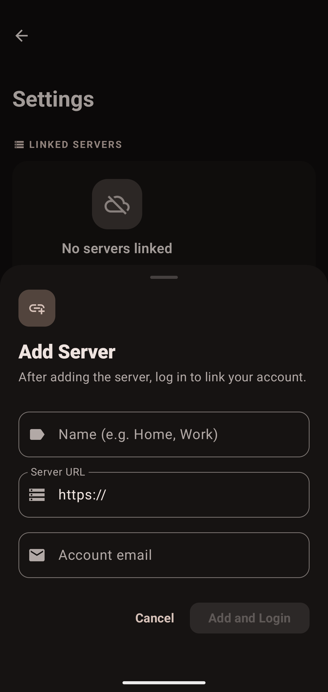

4. Tap **Next** — you will be taken to the login/register screen for that server
5. Log in or create a new account

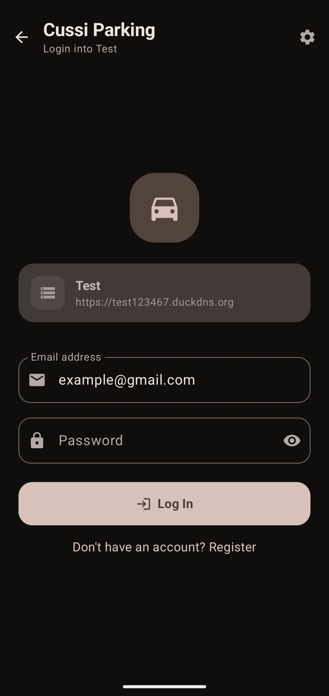 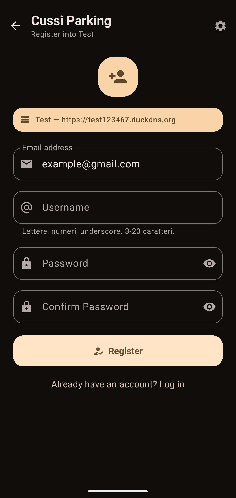

Once logged in, your vehicles are synced automatically from the server.

---

## Saving Your Vehicle's Location

There are four ways to save where you parked.

### Manual Save — Tap on Map

1. Open the app — the home screen shows a map with your vehicle's last known position
2. Long-press (or tap the save button) at any point on the map
3. Confirm the position

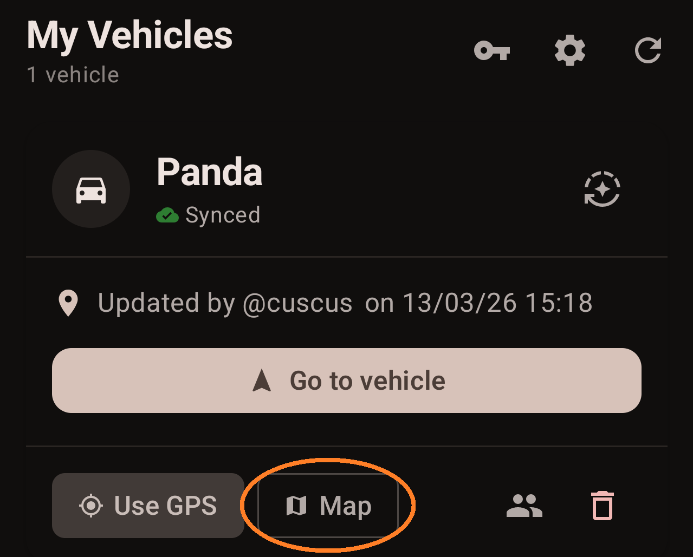
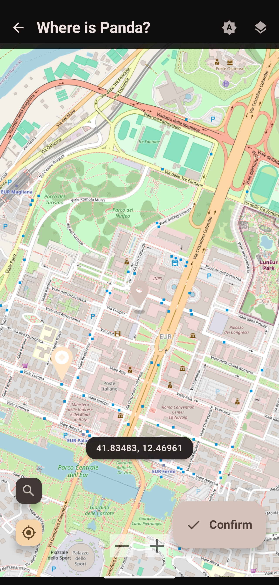

The map tile provider is **OpenStreetMap** — no Google account needed.

---

### Manual Save — GPS Button

If you want to save your current GPS position instantly, without tapping on the map:

1. On the home screen, tap the **GPS button**
2. The app requests a fresh location fix and saves it immediately
3. The position will of the car will be immediately overwritten.

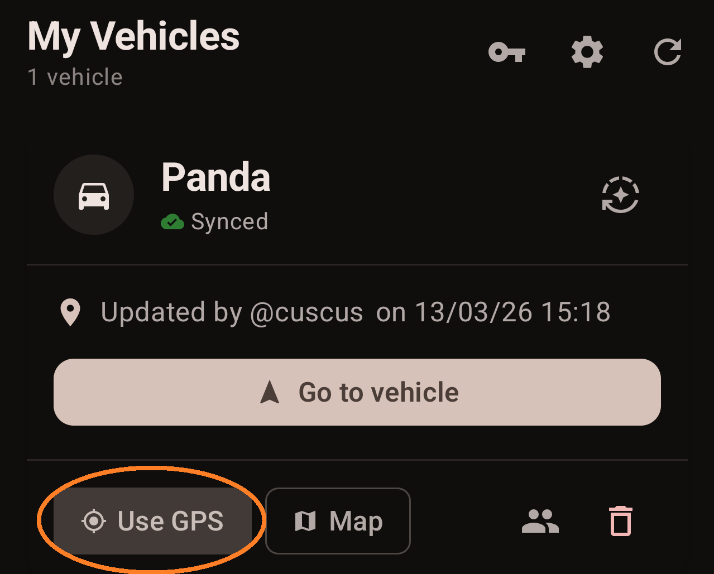

---

## Automatic Triggers

Triggers are the core of Cussi Parking. They detect when you leave your vehicle and save the position **without any user interaction**.

### How Triggers Work


To manage triggers for a vehicle, tap the **Triggers** button on any vehicle card on the home screen.

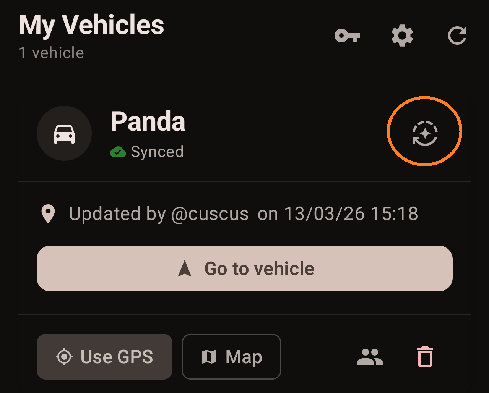

---

### Bluetooth Trigger

**Use case:** your car stereo or hands-free kit disconnects from your phone when you walk away.

**How to set it up:**

1. On the **Triggers** screen, tap **+ Add Trigger**
2. Grant location and Bluetooth permissions when prompted
3. **Step 1 — Type:** select **Bluetooth Disconnection**

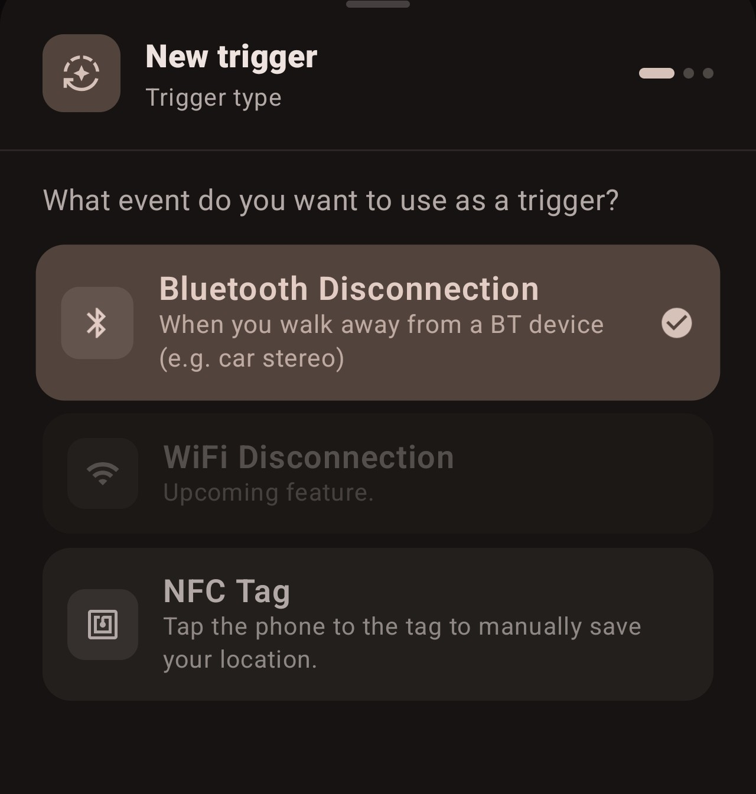

4. **Step 2 — Device:** choose your car's Bluetooth device from the list of paired devices

5. **Step 3 — GPS Mode:** choose how to acquire position (see [GPS Modes](#gps-modes-precise-vs-last-known))

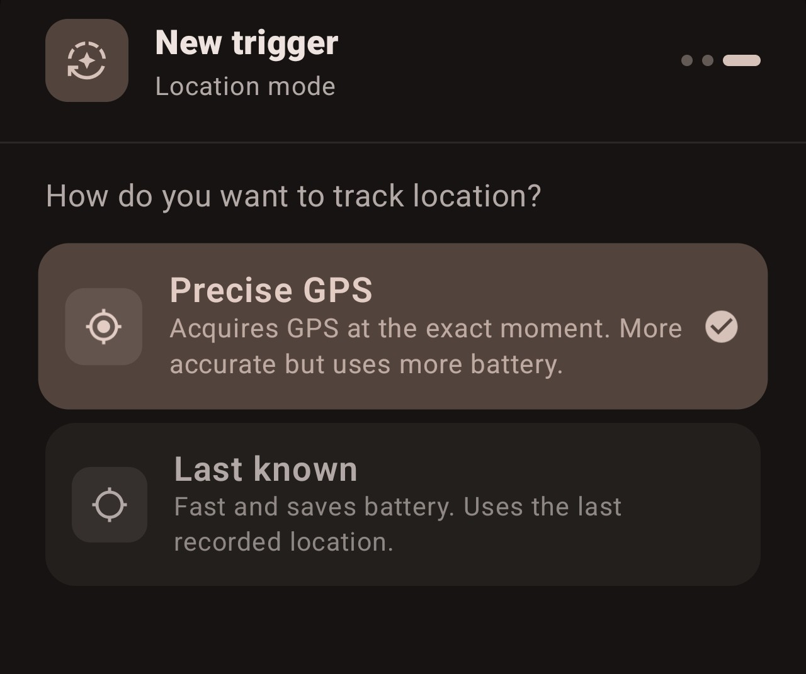

6. Tap **Add** — the trigger is saved

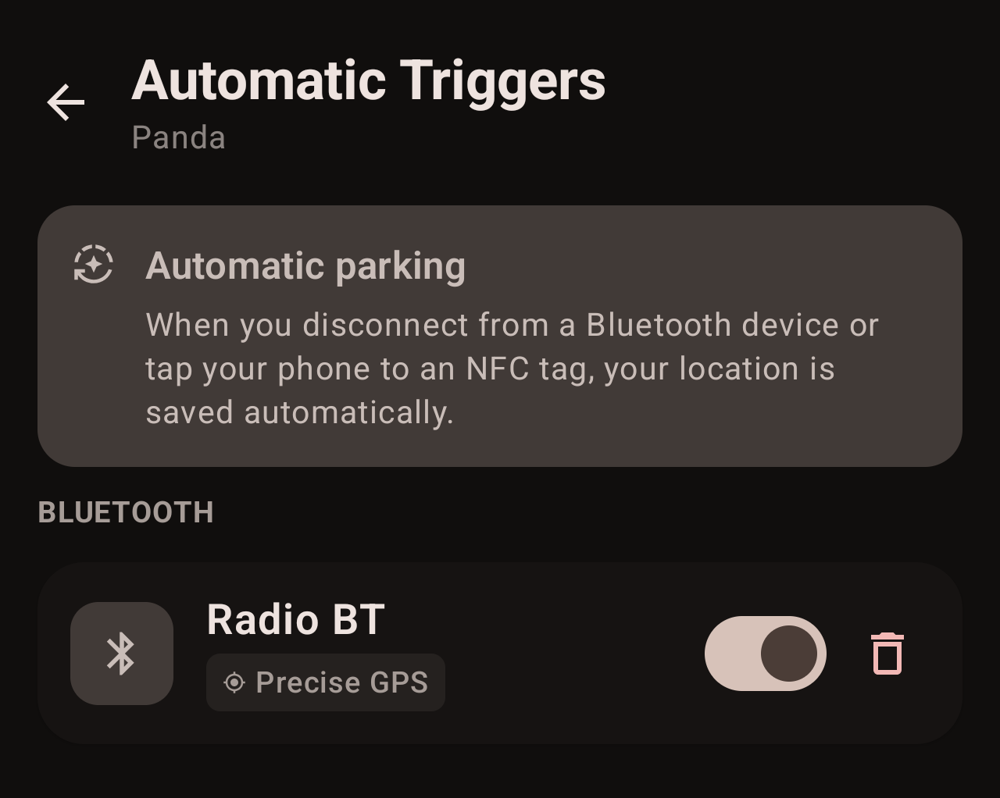

**How it works under the hood:**
`BluetoothTriggerReceiver` listens for `ACTION\_ACL\_DISCONNECTED` broadcasts. When it fires, it looks up all enabled Bluetooth triggers in the local database matching that MAC address, then enqueues a `ParkingLocationWorker` via WorkManager for each matching vehicle. This approach avoids `SecurityException` crashes on Android 14+ with the app in the background.

> \*\*Android battery optimization:\*\* For reliable background detection, you may need to disable battery optimization for Cussi Parking. The Triggers screen will warn you and offer a shortcut to the system setting.

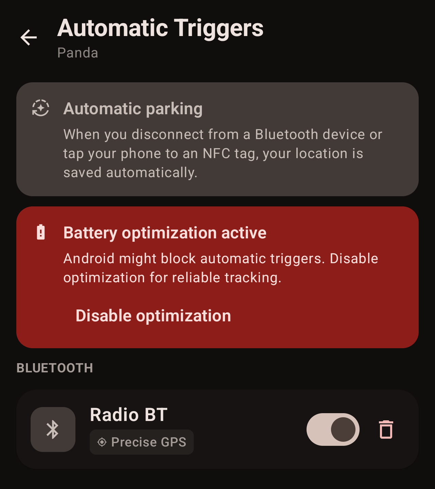

---

### NFC Trigger

**Use case:** place a cheap NFC sticker on your dashboard or sun visor. Every time you tap your phone on it before getting out, the parking spot is saved.

NFC trigger setup is a two-phase process: first you configure the trigger in the app, then you write the data onto the physical NFC tag.

#### Phase 1 — Create the Trigger

1. Tap **+ Add Trigger** then select **NFC Tag**

2. **Step 2:** give the tag a name (e.g., `Car Dashboard`, `Windshield`)

3. **Step 3:** choose GPS mode, then tap **Add**

The trigger appears in the list with a distinctive coin-style NFC icon.

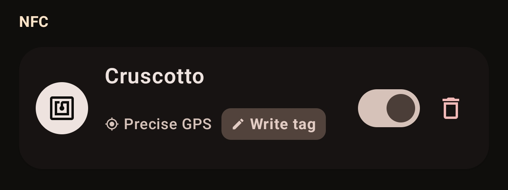

#### Phase 2 — Write the NFC Tag

1. On the NFC trigger card, tap **Write Tag**
2. A dialog appears with a pulsing NFC icon

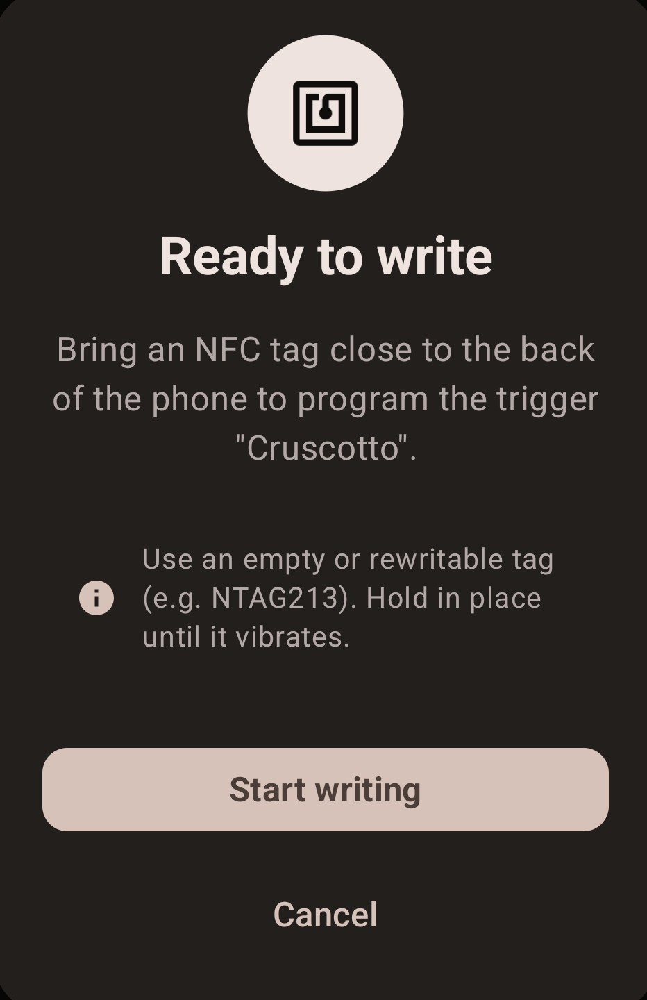

3. Tap **Start Writing**, then hold the NFC tag against the back of your phone
4. A toast confirms: `Tag NFC written successfully!`

The tag stores a URI in the format:
```

cussiparking://trigger?vehicleId=42\&mode=last\_known\&name=My+Car

```

#### Using an Unknown Tag (Cross-Device)

If you scan an NFC tag that was written by someone else's Cussi Parking install (e.g., a tag belonging to your partner's car profile), the app shows a **bottom sheet** asking you to associate the tag with one of your vehicles. Select the car you want to pair it with.

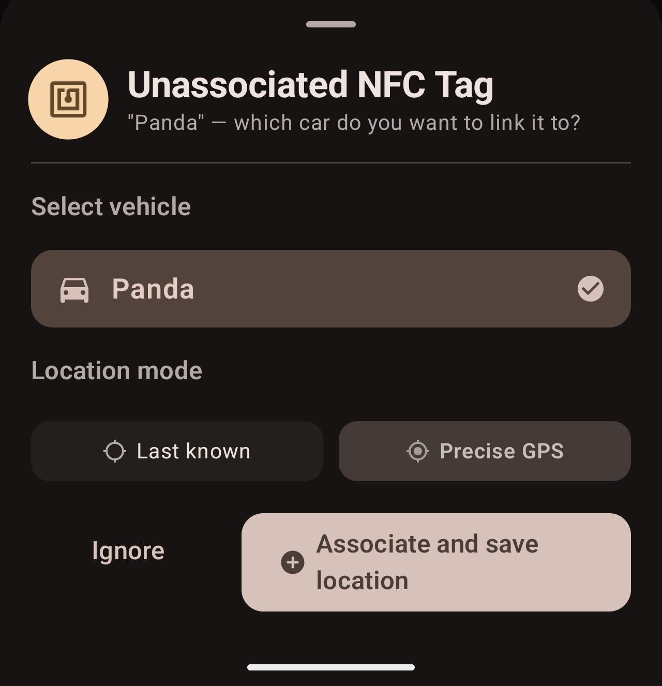

This cross-device mapping is stored locally — future scans of that tag will automatically save the position for your mapped vehicle.

---

### GPS Modes: Precise vs Last Known

Every trigger lets you choose how the GPS position is acquired when it fires:

| Mode | Description | Reliability |
|---|---|---|
| **Precise GPS** | Requests a fresh GPS fix (up to 15-second timeout). Falls back to Last Known if GPS does not respond in time. Requires Background Location permission. | Reliable. |
| **Last Known** | Uses the most recent position cached by the system's Fused Location Provider. Falls back to the last position saved in the app's database. Very fast, no timeout. | Not 100% reliable. |

---

## Finding Your Vehicle

**To navigate to your vehicle:**

Tap **Navigate** — this opens your preferred navigation app (Google Maps, OsmAnd, Waze, etc.) with the saved coordinates as the destination

The vehicle card also shows:
- The name of the vehicle
- The time the position was last updated
- Who last updated it when sharing with others
- A sync badge (yellow = pending upload, green = synced, grey = local only)

---

## Sharing a Vehicle

You can share a vehicle's location with other people (family members, colleagues) so they can also see where it's parked.

### Inviting Someone

1. On the home screen, tap the **Members** button on a vehicle card
2. Tap **Generate Invite Code** — a 24-hour invite code is created

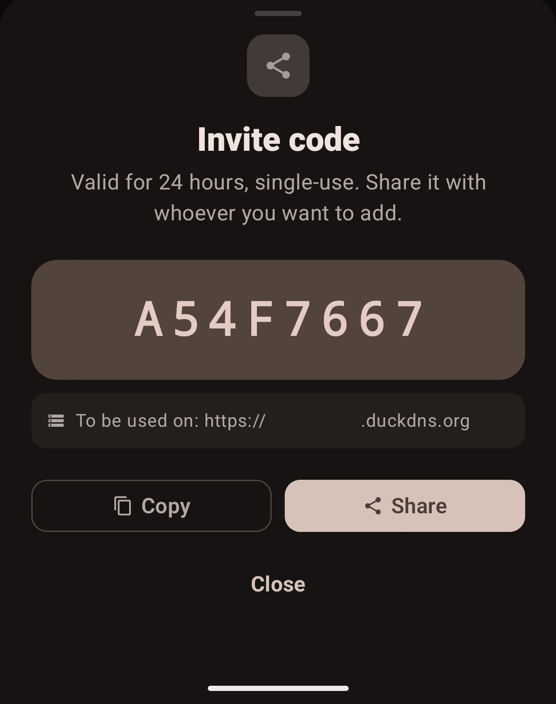

3. Share the code with the other person
4. They open their Cussi Parking app, go to **Settings**, tap **Join with Invite Code**, and paste the code

### Managing Members

The Members screen lets you:
- See who has access to the vehicle and their role (Owner or Member)
- Change a member's role
- Remove a member

**Roles:**
- `owner` — can update position, manage members, delete vehicle
- `member` — can view and update position only

---

## Multi-Server Support

Cussi Parking supports connecting to **multiple self-hosted servers** simultaneously. Each server profile is independent, with its own URL, account, and set of vehicles.

All vehicles from all profiles appear together on the home screen map. Each vehicle card shows the server label it belongs to (e.g., a small `Home` or `Work` tag).

If a server is unreachable during sync, a banner appears on the home screen listing which profiles could not be reached — vehicles from those profiles still show their last-known positions from the local database.

---

## Offline Mode

Cussi Parking can also work **entirely offline**. No account, no server, no internet required.

In offline mode:
- All vehicle data is stored in a local SQLite database (Room)
- All trigger-based saves work normally
- Manual saves work normally
- No data is ever sent anywhere

**Sync on reconnect:** if you later add a server profile, any positions saved while offline (marked as `syncState = 2`) will be pushed to the server on the next successful connection.

---

## Permissions Explained

Cussi Parking requests only the permissions it needs, and explains why on first ask.

| Permission | Why it's needed |
|---|---|
| `ACCESS\_FINE\_LOCATION` | Save precise GPS coordinates when you park |
| `ACCESS\_BACKGROUND\_LOCATION` | Required for automatic triggers to save position while the app is not open |
| `BLUETOOTH\_CONNECT` *(Android 12+)* | Read the name and MAC address of paired Bluetooth devices to set up a trigger |
| `ACCESS\_WIFI\_STATE` | Read the current WiFi SSID for WiFi trigger setup |
| `POST\_NOTIFICATIONS` | Show the "Position saved" notification after a trigger fires |
| `RECEIVE\_BOOT\_COMPLETED` | Re-activate trigger receivers after the phone restarts |
| `NFC` | Read and write NFC tags |
| `INTERNET` | Communicate with your self-hosted server |
| `REQUEST\_IGNORE\_BATTERY\_OPTIMIZATIONS` | Ask the system not to kill background trigger detection |

---

**Tech stack:**

- **Language:** Kotlin
- **UI:** Jetpack Compose + Material 3 Expressive
- **Navigation:** Navigation Compose
- **Database:** Room (SQLite), v7 with manual migrations
- **Networking:** Retrofit 2 + OkHttp + Gson
- **Location:** Google Play Services — Fused Location Provider
- **Background work:** WorkManager (CoroutineWorker)
- **Secure storage:** AndroidX Security Crypto (EncryptedSharedPreferences, AES256-GCM)
- **Maps:** osmdroid (OpenStreetMap, no API key needed)

---

## Self-Hosted Server

Cussi Parking requires the **[Cussi Parking Server](https://github.com/marcomorosi06/Cussi-Parking-Server)** backend, which you host yourself. It is a lightweight PHP + SQLite application designed to run on low-resource hardware, including a **Raspberry Pi Zero W**.

[](https://github.com/marcomorosi06/Cussi-Parking-Server)

### What the server provides

- Stateless PHP endpoints consumed by the Android app
- SQLite as the database engine — no MySQL or MariaDB required
- Token-based authentication with hashed credentials
- Role-based access control (owner / member)
- Time-limited invite codes for vehicle sharing
- Automated installer for ARMv6 / Raspberry Pi OS (Caddy + PHP-FPM + Let's Encrypt via DuckDNS)

### Quick setup on a Raspberry Pi

```bash

git clone \[https://github.com/marcomorosi06/Cussi-Parking-Server.git](https://github.com/marcomorosi06/Cussi-Parking-Server.git)

cd Cussi-Parking-Server

chmod +x install-32bit.sh

sudo ./install-32bit.sh

```

The script installs PHP-FPM, the Caddy web server, and sets up automatic SSL certificate renewal through DuckDNS. You will need a free DuckDNS subdomain and ports 80/443 forwarded on your router.

For **manual installation** on a standard VPS or x86 server, point any web server (Nginx, Apache, or Caddy) at the PHP files, ensure the `www-data` user has read/write access to the directory (required for SQLite), and secure the endpoint with SSL.

### API endpoints

| Endpoint | Description |
|---|---|
| `login.php` | Authenticate and receive an access token |
| `register.php` | Create a new user account |
| `add\_vehicle.php` | Add a new vehicle |
| `delete\_vehicle.php` | Remove a vehicle |
| `get\_locations.php` | Fetch all vehicles and their latest GPS positions |
| `update\_location.php` | Save a new GPS position for a vehicle |
| `get\_members.php` | List members of a shared vehicle |
| `add\_member.php` | Add a member by username |
| `remove\_member.php` | Remove a member |
| `change\_role.php` | Change a member's role |
| `invite\_code.php` | Generate or consume a 24-hour invite code |
| `delete\_account.php` | Permanently delete an account |

All responses are JSON. All requests are form-encoded POST with a `token` field for authentication.

---

## Privacy

- **No analytics, no telemetry, no ads.** Cussi Parking does not track usage.
- All location data is stored locally on-device (Room database) and optionally on your own server — never on third-party infrastructure.
- Credentials are stored in **EncryptedSharedPreferences** using AES256-GCM and never appear in plain text in storage.
- NFC tags store only a vehicle ID, a GPS mode preference, and an optional name — no personal information.

---

## Contributing

Pull requests are welcome. If you find a bug or have a feature idea, please open an issue first to discuss it.

```bash

git clone \[https://github.com/marcomorosi06/Cussi-Parking-Android.git](https://github.com/marcomorosi06/Cussi-Parking-Android.git)

```

Open in Android Studio Hedgehog or later

Build with compileSdk 36, minSdk 26

---

## Building from Source

If you prefer to build the app manually using Gradle instead of Android Studio, you can do so directly from your terminal:

1. **Clone the repository:**
   ```bash
   git clone [https://github.com/marcomorosi06/Cussi-Parking-Android.git](https://github.com/marcomorosi06/Cussi-Parking-Android.git)
   ```
2. **Navigate to the project directory:**
   ```bash
   cd Cussi-Parking-Android
   ```
3. **Make the Gradle wrapper executable (macOS/Linux only):**
   ```bash
   chmod +x gradlew
   ```
4. **Compile the app:**
   Run the following command to build a debug APK:
   ```bash
   ./gradlew assembleDebug
   ```
   *(Note: If you are using Windows, run `gradlew.bat assembleDebug` instead).*
5. **Install the APK:**
   Once the build completes successfully, you can find the generated APK file at:
   `app/build/outputs/apk/debug/app-debug.apk`

---

## License

This project is licensed under the MIT License. See the [LICENSE](LICENSE) file in the root directory of this repository for more information.

---

Made with <3 by [marcomorosi06](https://github.com/marcomorosi06)
